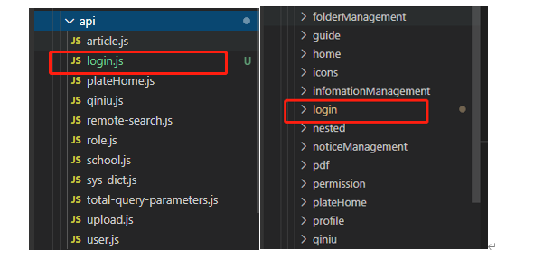
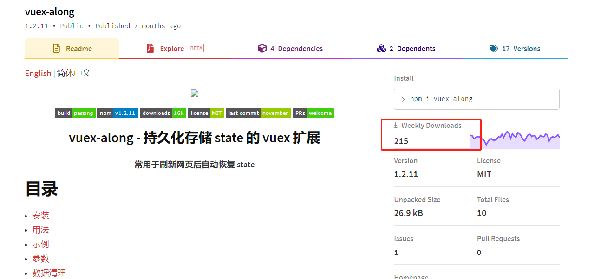
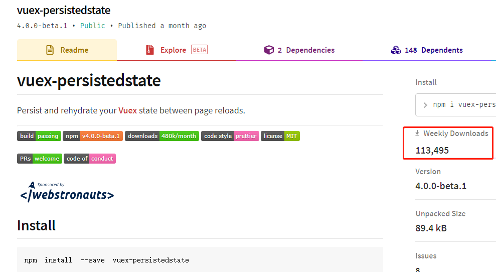
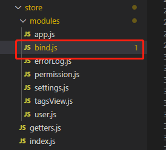
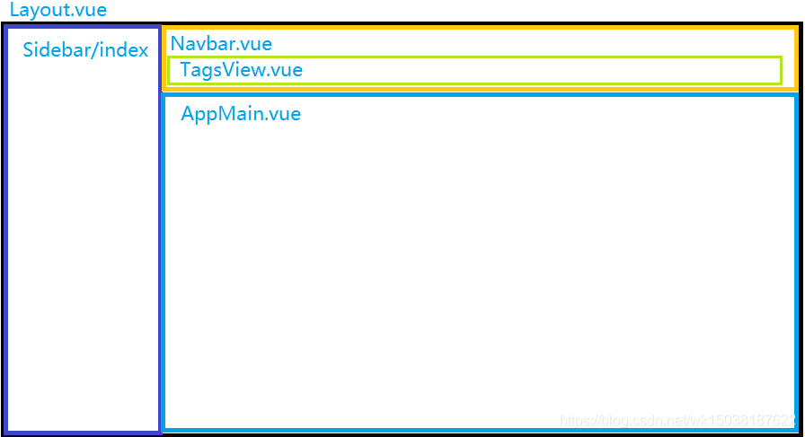

# vue-element-admin

[vscode 插件和配置推荐](https://github.com/varHarrie/Dawn-Blossoms/issues/10)

> 这是一篇对 vue-element-admin 的学习总结文章。

[官方文档](https://panjiachen.github.io/vue-element-admin-site/zh/)

# 目录结构

```bash
├── build                      # 构建相关
├── mock                       # 项目mock 模拟数据
├── plop-templates             # 基本模板
├── public                     # 静态资源
│   │── favicon.ico            # favicon图标
│   └── index.html             # html模板
├── src                        # 源代码
│   ├── api                    # 所有请求
│   ├── assets                 # 主题 字体等静态资源
│   ├── components             # 全局公用组件
│   ├── directive              # 全局指令
│   ├── filters                # 全局 filter
│   ├── icons                  # 项目所有 svg icons
│   ├── lang                   # 国际化 language
│   ├── layout                 # 全局 layout
│   ├── router                 # 路由
│   ├── store                  # 全局 store管理
│   ├── styles                 # 全局样式
│   ├── utils                  # 全局公用方法
│   ├── vendor                 # 公用vendor
│   ├── views                  # views 所有页面
│   ├── App.vue                # 入口页面
│   ├── main.js                # 入口文件 加载组件 初始化等
│   └── permission.js          # 权限管理
├── tests                      # 测试
├── .env.xxx                   # 环境变量配置
├── .eslintrc.js               # eslint 配置项
├── .babelrc                   # babel-loader 配置
├── .travis.yml                # 自动化CI配置
├── vue.config.js              # vue-cli 配置
├── postcss.config.js          # postcss 配置
└── package.json               # package.json
```

# 开始开发

```bash
# 克隆项目
git clone https://github.com/PanJiaChen/vue-element-admin.git

# 进入项目目录
cd vue-element-admin

# 安装依赖
npm install

# 建议不要直接使用 cnpm 安装依赖，会有各种诡异的 bug。可以通过如下操作解决 npm 下载速度慢的问题
npm install --registry=https://registry.npm.taobao.org

# 启动服务
npm run dev

#发布

#正式环境
npm run build:prod

#集成环境
npm run sit
```

> 如果`node-sass`安装报错的话，可以重试`npm install node-sass`，如果还是不行的话，可以`npm install --registry=https://registry.npm.taobao.org/`，再安装；实在不行的话用`cnpm install node-sass`安装这个包感觉也没关系，虽然文档不建议，但是这个包用`cnpm`肯定是没问题的

node-sass报错可参考链接：https://github.com/PanJiaChen/vue-element-admin/issues/24

# 一、src 目录

> views 和 api 两个模块一一对应，从而方便维护
>
> api：请求接口文件夹
>
> views：页面组件文件夹

## api

> 一个`.js`对应一个`views文件夹`里面的一个模块

例如：



api 里面的`login.js`，对应的是 views 里面的`login`文件夹，如果有公共模块就单独放置就好

### 用法：

#### 1. 先在/src/api 新建`xxx.js`，例如`bind.js`

#### 2. 引入

```js
import axios from "@/utils/request";
import * as qs from "qs";

// 解除管控-列表页
export const deleteClassPlateCtrlByBatch = (params) => {
  return axios.post(
    `ctrlSystem/deleteClassPlateCtrlByBatch`,
    qs.stringify(params)
  );
};
```

#### 3. 使用

##### 3.1 引入

```js
import { deleteStudentPlateCtrlByBatch } from "@/api/bindManage";
```

##### 3.2 函数中使用

```js
deleCtro(){
     let defaultBaseInfo = this.$store.state.user.defaultBaseInfo;
     let obj = {
        interUser: "runLfb",
        interPwd: hex_md5(1234578),
        operateAccountNo: defaultBaseInfo.operateAccountNo,
        belongSchoolId: defaultBaseInfo.belongSchoolId,
        schoolId: queryObj.schoolId,
        classId: queryObj.classId,
        surfacePlateBindRequestVoList: this.classIdList,
      };
      let params = {
        requestJson: JSON.stringify(obj)
      }
      console.log(obj);
      deleteStudentPlateCtrlByBatch(params).then((r) => {
        console.log("deleteClassPlateCtrlByBatch", r);
        this.success(r);
      });
}
```

## 封装 axios

#### 1. /src/utils/request.js

```js
import Vue from "vue";
import axios from "axios";
import { MessageBox, Message } from "element-ui";
import store from "@/store";
import { getToken } from "@/utils/auth";
import router from "../router";
import { Loading } from "element-ui";
import Cookies from "js-cookie";
// create an axios instance
const service = axios.create({
  baseURL: process.env.VUE_APP_BASE_API, // url = base url + request url
  // withCredentials: true, // send cookies when cross-domain requests
  timeout: 10000, // request timeout
});

// //========================================================token ======================================
var loading = ""; //定义loading变量

function startLoading() {
  //使用Element loading-start 方法
  loading = Loading.service({
    lock: true,
    // text: '加载中……',
    background: "rgba(0, 0, 0, 0)",
  });
}
function endLoading() {
  //使用Element loading-close 方法
  loading.close();
}
// 刷新token的过期时间判断
function isRefreshTokenExpired() {
  const oData = store.getters.getTokenTime; // 这是在登陆时候保存的时间戳
  const nDta = new Date().getTime();
  const stamp = nDta - oData; // 相差的微秒数
  // const seconds = parseInt((stamp % (1000 * 60 * 60)) / 1000)  错误的计算，秒数差永远<3600
  const seconds = parseInt(stamp / 1000);
  return (
    seconds >= (store.getters.getTokenUsable * 3) / 4 &&
    seconds < store.getters.getTokenUsable
  );
  // return false
}
// 刷新token
function getRefreshToken() {
  // 刷新token 注意这里用到的service
  return service.post("/public/regenerationToken").then((res) => {
    return Promise.resolve(res.data);
  });
}

// 是否正在刷新的标志
window.isRefreshing = false;
// 存储请求的数组
let refreshSubscribers = [];

/* 将所有的请求都push到数组中*/
function subscribeTokenRefresh(cb) {
  refreshSubscribers.push(cb);
}

// 数组中的请求得到新的token之后自执行，用新的token去请求数据
function onRrefreshed(token) {
  refreshSubscribers.map((cb) => cb(token));
}
// 删除cookie
function removeCookie() {
  Cookies.remove("username", { path: "/" });
  Cookies.remove("password", { path: "/" });
}
// request interceptor
service.interceptors.request.use(
  (config) => {
    startLoading();
    let url = config.url;
    // 解决问题：axios不会对url中的功能性字符进行编码，手动编码
    // get参数编码
    if (config.method === "get" && config.params) {
      url += "?";
      const keys = Object.keys(config.params);
      for (const key of keys) {
        url += `${key}=${encodeURIComponent(config.params[key])}&`;
      }
      url = url.substring(0, url.length - 1);
      config.params = {};
    }
    config.url = url;

    const accessToken = store.getters.getAccessToken; // 本地保存的token
    const refreshToken = store.getters.getRefreshToken; // 本地保存的token
    /* 判断token是否存在*/
    if (accessToken && accessToken != "undefined") {
      /* 在请求头中添加token类型、token*/
      config.headers.access_token = accessToken;
      config.headers.client_type = store.state.user.client_type;
      // config.url = config.url + '?t=' + (new Date()).getTime().toString(); // 清楚缓存
      /* 判断token是否将要过期 */
      if (
        isRefreshTokenExpired() &&
        config.url.indexOf("public/regenerationToken") === -1
      ) {
        if (!window.isRefreshing) {
          // /*判断是否正在刷新*/
          window.isRefreshing = true;
          /* 发起刷新token的请求*/
          // config.headers.Authorization = ''
          getRefreshToken();

          /* 把请求(token)=>{....}都push到一个数组中*/
          const retry = new Promise((resolve, reject) => {
            /* (token) => {...}这个函数就是回调函数*/
            subscribeTokenRefresh((token) => {
              // config.headers.common['Authorization'] = 'bearer ' + token;
              config.headers.access_token = token;
              /* 将请求挂起*/
              resolve(config);
            });
          });
          return retry;
        }
        return config;
      } else if (config.url.search(/\/public\/regenerationToken$/) >= 0) {
        config.headers.refresh_token = refreshToken;
        return config;
      } else {
        return config;
      }
    } else {
      return config;
    }
  },
  (error) => {
    return Promise.reject(error);
  }
);

// response interceptor
service.interceptors.response.use(
  /**
   * 根据后端的code码，做一些操作
   */
  (response) => {
    endLoading();
    const res = response.data;
    // 没有身份令牌或过期
    if (res.code == 11002 || res.code == 11001) {
      store.commit("user/setAccessToken", null);
      store.commit("user/setRefreshToken", null);
      store.commit("user/setTokenTime", null);
      store.commit("user/setTokenUsable", null);
      localStorage.clear();
      removeCookie();
      Message({
        message: "登录信息失效，请重新登录",
        type: "error",
        duration: 3 * 1000,
      });
      router.push("/login");
    }
    // alert(response.config.url)
    // console.log(response.config.url, 'response.config.url')
    if (
      (response.config.url.search(/\/user\/phoneLogin$/) >= 0 && res.flag) ||
      (response.config.url.search(/\/user\/registerByVerificationCode$/) >= 0 &&
        res.flag)
    ) {
      store.commit("user/setAccessToken", response.headers.access_token);
      store.commit("user/setRefreshToken", response.headers.refresh_token);
      store.commit("user/setTokenTime", new Date().getTime());
      store.commit("user/setTokenUsable", response.headers.token_usable);
    } else if (
      response.config.url.search(/\/public\/regenerationToken$/) >= 0
    ) {
      if (res.code == "0") {
        store.commit("user/setAccessToken", response.headers.access_token);
        store.commit("user/setRefreshToken", response.headers.refresh_token);
        store.commit("user/setTokenTime", new Date().getTime());
        store.commit("user/setTokenUsable", response.headers.token_usable);
        onRrefreshed(response.headers.access_token);
        window.isRefreshing = false;
        refreshSubscribers = [];
      } else {
        /* 清除本地保存的*/
        store.commit("user/setAccessToken", null);
        store.commit("user/setRefreshToken", null);
        store.commit("user/setTokenTime", null);
        store.commit("user/setTokenUsable", null);
        localStorage.clear();
        removeCookie();
        Message({
          message: "登录信息失效，请重新登录",
          type: "error",
          duration: 3 * 1000,
        });
        router.push("/login");
      }
    }
    return Promise.resolve(res);
  },
  (error) => {
    // Vue.prototype.$log4b.error("响应错误"+error.config.url+"错误信息"+JSON.stringify(error) )
    console.log("err", error); // for debug
    if (error && error.response) {
      switch (error.response.status) {
        case 400:
          error.message = "请求错误(400)";
          break;
        case 401:
          return history.push("/login");
          break;
        case 403:
          error.message = "拒绝访问(403)";
          break;
        case 404:
          error.message = "请求出错(404)";
          break;
        case 408:
          error.message = "请求超时(408)";
          break;
        case 500:
          error.message = "服务器错误(500)";
          break;
        case 501:
          error.message = "服务未实现(501)";
          break;
        case 502:
          error.message = "网络错误(502)";
          break;
        case 503:
          error.message = "服务不可用(503)";
          break;
        case 504:
          error.message = "网络超时(504)";
          break;
        case 505:
          error.message = "HTTP版本不受支持(505)";
          break;
        default:
          error.message = `连接出错(${error.response.status})!`;
      }
      Message({
        message: error.message,
        type: "error",
        duration: 3 * 1000,
      });
    }
    return Promise.reject(error);
  }
);

export default service;
```

## components

> components 放置的都是全局公用的一些组件，简单来说就是多个页面能用到的，不只是你当前页面，如上传组件；一些页面级的组件建议还是放在各自 views 文件下，方便管理。

## store

> 用来写 vuex

### 用法：

##### 1. ./store/index.js

> vuex-along：解决 vuex 刷新消失问题，周下载量 215
>
> [vuex-along 使用文档地址](https://www.npmjs.com/package/vuex-along)
>
> vuex-persistedstate：解决 vuex 刷新消失问题，周下载量 10w+
>
> [vuex-persistedstate 使用文档地址](https://www.jianshu.com/p/7fb432e7594e)
>
> 后续建议使用`vuex-persistedstate`

- vuex-along 周下载量



- vuex-persistedstate 周下载量



```js
import Vue from "vue";
import Vuex from "vuex";
import getters from "./getters";
import createVuexAlong from "vuex-along";
Vue.use(Vuex);

// https://webpack.js.org/guides/dependency-management/#requirecontext
const modulesFiles = require.context("./modules", true, /\.js$/);

// you do not need `import app from './modules/app'`
// it will auto require all vuex module from modules file
const modules = modulesFiles.keys().reduce((modules, modulePath) => {
  // set './app.js' => 'app'
  const moduleName = modulePath.replace(/^\.\/(.*)\.\w+$/, "$1");
  const value = modulesFiles(modulePath);
  modules[moduleName] = value.default;
  return modules;
}, {});

const store = new Vuex.Store({
  modules,
  getters,
  plugins: [createVuexAlong()],
});

export default store;
```

##### 2.0. 在/store/modules/新建`xxx.js`，例如，`bind.js`



##### 2.1. bind.js 代码：

```js
const state = {
  bindFilter: "", //筛选条件缓存
  detailRouter: false, //是否是详情页回来的
};

const mutations = {
  bindFilter_Fun: (state, data) => {
    state.bindFilter = data;
    localStorage.setItem("bindFilter", JSON.stringify(data)); //缓存在localStorage里面，解决vuex刷新消失问题
  },
  detailRouter_Fun: (state, data) => {
    state.detailRouter = data;
    localStorage.setItem("detailRouter", JSON.stringify(data));
  },
};

const actions = {
  bindFilter({ commit, state }, data) {
    commit("bindFilter_Fun", data);
  },
  detailRouter({ commit, state }, data) {
    commit("detailRouter_Fun", data);
  },
};

export default {
  namespaced: true,
  state,
  mutations,
  actions,
};
```

##### 3. /store/getters.js

```js
const getters = {
  // 绑定管理筛选数据
  getBindFilter: (state) =>
    state.bind.bindFilter || JSON.parse(localStorage.getItem("bindFilter")),
  getDetailRouter: (state) =>
    state.bind.detailRouter || JSON.parse(localStorage.getItem("detailRouter")),
};
export default getters;
```

##### 4.组件里面的用法

> 更多方法请查看：https://www.jianshu.com/p/0f13a6bec687

```
存入数据：this.$store.dispatch("bind/detailRouter", false)
获取数据：this.$store.getters.getDetailRouter
```

##### 5.namespaced

> vuex 中的 store 分模块管理，需要在 store 的 index.js 中引入各个模块，为了解决不同模块命名冲突的问题，将不同模块的 namespaced:true，之后在不同页面中引入 getter、actions、mutations 时，需要加上所属的模块名，相反，如果 namespaced:false 就是正常使用不用加模块名字；

[文档链接](https://www.jianshu.com/p/0f13a6bec687)

## icon 图标的使用方式

> 把下载好的图标放入`/src/icons/svg/`文件夹

### 1. 使用方式

```html
<svg-icon icon-class="password" /> // icon-class 为 icon 的名字
```

### 2. 改变颜色

> `svg-icon` 默认会读取其父级的 color `fill: currentColor;`
>
> 你可以改变父级的`color`或者直接改变`fill`的颜色即可。

[相关文档](https://juejin.im/post/6844903517564436493)

# 二、layout布局

> 这里简单看一下layout的布局，方便以后好修改；
>
> 简单来说就是app.vue里面包含着layout，layout又包含着TagsView，sideBar，AppMain；然后我们写的东西都是在AppMain里面的

- app.vue
  - layout
    - TagsView
    - sideBar
    - AppMain (内容容器)




# 三、环境变量配置

## 1. 本地开发环境

> .env.development---这个对应本地地址打包环境

```js
# just a flag
ENV = 'development'

# base api
#VUE_APP_BASE_API = '/dev-api'

#代理服务器api
#VUE_APP_BASE_API = '/api' 接口地址

#不用代理服务器api 接口地址
VUE_APP_BASE_API = 'http://119.23.xxx.xxx:9001/service-soa'

# vue-cli uses the VUE_CLI_BABEL_TRANSPILE_MODULES environment variable,
# to control whether the babel-plugin-dynamic-import-node plugin is enabled.
# It only does one thing by converting all import() to require().
# This configuration can significantly increase the speed of hot updates,
# when you have a large number of pages.
# Detail:  https://github.com/vuejs/vue-cli/blob/dev/packages/@vue/babel-preset-app/index.js
#开发环境不使用路由懒加载
VUE_CLI_BABEL_TRANSPILE_MODULES = true
```

## 2. 上线正式环境

> .env.production------这个对应正式环境

```js
# just a flag
ENV = 'production'

# base api 接口地址
VUE_APP_BASE_API = 'http://119.23.xxx.xx:8080/service-soa'
```

## 3. 集成测试环境

> .env.sit------这个对应正式环境

```js
#
NODE_ENV = production

# just a flag
ENV = 'sit'

# base api 接口地址
VUE_APP_BASE_API = 'http://119.23.xxx.71:9001/service-soa'
```

# 四、 vue.config.js

> [相关文档-My](https://www.jianshu.com/p/a8f0e1dfa825)
>
> [相关文档-Other](https://blog.csdn.net/weixin_41404460/article/details/94717481)

```js
"use strict";
const path = require("path");
const defaultSettings = require("./src/settings.js");
function resolve(dir) {
  return path.join(__dirname, dir);
}
const name = defaultSettings.title || "vue Element Admin"; // page title
const port = process.env.port || process.env.npm_config_port || 9530; // 端口号 port
module.exports = {
  publicPath: "/",
  outputDir: "dist",
  assetsDir: "static",
  // lintOnSave: process.env.NODE_ENV === 'development',
  lintOnSave: false,
  productionSourceMap: false,
  devServer: {
    hot: true, // 热加载
    port: port,
    https: false, // false关闭https，true为开启
    // open: true,
    overlay: {
      warnings: false,
      errors: true,
    },
    // before: require('./mock/mock-server.js'),
    proxy: {
      "/api": {
        target: "http://119.23.xxx.xxx:9001/service-soa",
        // 在本地会创建一个虚拟服务端，然后发送请求的数据，并同时接收请求的数据，这样服务端和服务端进行数据的交互就不会有跨域问题
        changeOrigin: true,
        ws: true,
        pathRewrite: {
          // 替换target中的请求地址，也就是说以后你在请求http://api.jisuapi.com/XXXXX这个地址的时候直接写成/api/xxx即可
          "^/api": "/",
        },
      },

      "/qq": {
        target: "https://xxx.qq.com/oauth2.0",
        // 在本地会创建一个虚拟服务端，然后发送请求的数据，并同时接收请求的数据，这样服务端和服务端进行数据的交互就不会有跨域问题
        changeOrigin: true,
        ws: true,
        pathRewrite: {
          // 替换target中的请求地址，也就是说以后你在请求http://api.jisuapi.com/XXXXX这个地址的时候直接写成/api/xxx即可
          "^/qq": "/",
        },
      },
      "/oss": {
        target: "http://xxx.xxx.aliyuncs.com",
        // 在本地会创建一个虚拟服务端，然后发送请求的数据，并同时接收请求的数据，这样服务端和服务端进行数据的交互就不会有跨域问题
        changeOrigin: true,
        ws: true,
        pathRewrite: {
          // 替换target中的请求地址，也就是说以后你在请求http://api.jisuapi.com/XXXXX这个地址的时候直接写成/api/xxx即可
          "^/oss": "/",
        },
      },
    },
  },
  configureWebpack: {
    // provide the app's title in webpack's name field, so that
    // it can be accessed in index.html to inject the correct title.
    name: name,
    resolve: {
      alias: {
        "@": resolve("src"),
      },
    },
  },
  chainWebpack(config) {
    config.plugins.delete("preload"); // TODO: need test
    config.plugins.delete("prefetch"); // TODO: need test

    // set svg-sprite-loader
    config.module.rule("svg").exclude.add(resolve("src/icons")).end();
    config.module
      .rule("icons")
      .test(/\.svg$/)
      .include.add(resolve("src/icons"))
      .end()
      .use("svg-sprite-loader")
      .loader("svg-sprite-loader")
      .options({
        symbolId: "icon-[name]",
      })
      .end();

    // set preserveWhitespace
    config.module
      .rule("vue")
      .use("vue-loader")
      .loader("vue-loader")
      .tap((options) => {
        options.compilerOptions.preserveWhitespace = true;
        return options;
      })
      .end();

    config
      // https://webpack.js.org/configuration/devtool/#development
      .when(process.env.NODE_ENV === "development", (config) =>
        config.devtool("cheap-source-map")
      );

    config.when(process.env.NODE_ENV !== "development", (config) => {
      config
        .plugin("ScriptExtHtmlWebpackPlugin")
        .after("html")
        .use("script-ext-html-webpack-plugin", [
          {
            // `runtime` must same as runtimeChunk name. default is `runtime`
            inline: /runtime\..*\.js$/,
          },
        ])
        .end();
      config.optimization.splitChunks({
        chunks: "all",
        cacheGroups: {
          libs: {
            name: "chunk-libs",
            test: /[\\/]node_modules[\\/]/,
            priority: 10,
            chunks: "initial", // only package third parties that are initially dependent
          },
          elementUI: {
            name: "chunk-elementUI", // split elementUI into a single package
            priority: 20, // the weight needs to be larger than libs and app or it will be packaged into libs or app
            test: /[\\/]node_modules[\\/]_?element-ui(.*)/, // in order to adapt to cnpm
          },
          commons: {
            name: "chunk-commons",
            test: resolve("src/components"), // can customize your rules
            minChunks: 3, //  minimum common number
            priority: 5,
            reuseExistingChunk: true,
          },
        },
      });
      config.optimization.runtimeChunk("single");
    });
  },
};
```

# 五、 package.json

```json
{
  "name": "vue-element-admin",
  "version": "4.2.1",
  "description": "A magical vue admin. An out-of-box UI solution for enterprise applications. Newest development stack of vue. Lots of awesome features",
  "author": "Pan <panfree23@gmail.com>",
  "license": "MIT",
  "scripts": {
    "dev": "vue-cli-service serve --open",
    "sit": "vue-cli-service build --mode sit",
    "prod": "vue-cli-service build --mode production",
    "build:prod": "vue-cli-service build",
    "build:stage": "vue-cli-service build --mode staging",
    "preview": "node build/index.js --preview",
    "lint": "eslint --ext .js,.vue src",
    "test:unit": "jest --clearCache && vue-cli-service test:unit",
    "test:ci": "npm run lint && npm run test:unit",
    "svgo": "svgo -f src/icons/svg --config=src/icons/svgo.yml",
    "new": "plop"
  },
  "lint-staged": {
    "src/**/*.{js,vue}": ["eslint --fix", "git add"]
  },
  "keywords": [
    "vue",
    "admin",
    "dashboard",
    "element-ui",
    "boilerplate",
    "admin-template",
    "management-system"
  ],
  "repository": {
    "type": "git",
    "url": "git+https://github.com/PanJiaChen/vue-element-admin.git"
  },
  "bugs": {
    "url": "https://github.com/PanJiaChen/vue-element-admin/issues"
  },
  "dependencies": {
    "@fortawesome/fontawesome-svg-core": "^1.2.29",
    "@fortawesome/free-brands-svg-icons": "^5.13.1",
    "@fortawesome/free-regular-svg-icons": "^5.13.1",
    "@fortawesome/free-solid-svg-icons": "^5.13.1",
    "@fortawesome/vue-fontawesome": "^0.1.10",
    "arr2tree": "0.0.5",
    "axios": "0.18.1",
    "clipboard": "2.0.4",
    "codemirror": "5.45.0",
    "crypto-js": "^4.0.0",
    "driver.js": "0.9.5",
    "dropzone": "5.5.1",
    "echarts": "4.2.1",
    "element-ui": "2.13.0",
    "file-saver": "2.0.1",
    "fingerprintjs2": "^2.1.0",
    "fundebug-javascript": "^2.4.2",
    "fundebug-vue": "0.0.1",
    "fuse.js": "3.4.4",
    "js-cookie": "2.2.0",
    "jsonlint": "1.6.3",
    "jszip": "3.2.1",
    "kindeditor": "^4.1.10",
    "moment": "^2.27.0",
    "normalize.css": "7.0.0",
    "nprogress": "0.2.0",
    "path-to-regexp": "2.4.0",
    "qrcode": "^1.4.4",
    "qrcodejs2": "0.0.2",
    "screenfull": "4.2.0",
    "script-loader": "0.7.2",
    "showdown": "1.9.0",
    "sortablejs": "1.8.4",
    "tui-editor": "1.3.3",
    "vue": "2.6.10",
    "vue-count-to": "1.0.13",
    "vue-router": "3.0.2",
    "vue-splitpane": "1.0.4",
    "vuedraggable": "2.20.0",
    "vuex": "3.1.0",
    "vuex-along": "^1.2.11",
    "wangeditor": "^3.1.1",
    "xlsx": "0.14.1"
  },
  "devDependencies": {
    "@babel/core": "7.0.0",
    "@babel/register": "7.0.0",
    "@vue/cli-plugin-babel": "3.5.3",
    "@vue/cli-plugin-eslint": "^3.9.1",
    "@vue/cli-plugin-unit-jest": "3.5.3",
    "@vue/cli-service": "3.5.3",
    "@vue/test-utils": "1.0.0-beta.29",
    "autoprefixer": "^9.5.1",
    "babel-core": "7.0.0-bridge.0",
    "babel-eslint": "10.0.1",
    "babel-jest": "23.6.0",
    "chalk": "2.4.2",
    "chokidar": "2.1.5",
    "connect": "3.6.6",
    "eslint": "5.15.3",
    "eslint-plugin-vue": "5.2.2",
    "html-webpack-plugin": "3.2.0",
    "husky": "1.3.1",
    "lint-staged": "8.1.5",
    "mockjs": "1.0.1-beta3",
    "node-sass": "^4.9.0",
    "plop": "2.3.0",
    "runjs": "^4.3.2",
    "sass-loader": "^7.1.0",
    "script-ext-html-webpack-plugin": "2.1.3",
    "serve-static": "^1.13.2",
    "svg-sprite-loader": "4.1.3",
    "svgo": "1.2.0",
    "vue-template-compiler": "2.6.10"
  },
  "engines": {
    "node": ">=8.9",
    "npm": ">= 3.0.0"
  },
  "browserslist": ["> 1%", "last 2 versions"]
}
```

# 六、权限

## 1. 路由权限

#### 流程：

> 1.登录页面按钮点击
> 2.vuex 里面的 login 方法被调用
> 3.vuex 里面的 login 方法被调用 完毕 4.监听路由改变 然后获取当前登录的用户角色 5.获取当前用户信息 获取角色组 并保存登录状态,返回当前角色信息 6.通过 角色 和 所有路由 匹配出对应角色拥有的路由权限 返回路由组
> 7 将上面获取到的 路由权限 挂载到真实的路由上面去

#### 路由权限涉及文件：

> /src/views/login/index.vue 登录页面的入口文件
>
> /src/store/modules/user.js vuex 的文件 全局方法
>
> /src/permission.js 监听路由改变后的 js
>
> /src/store/mudules/permission.js 通过 角色返回 登录角色的对应路由列表的方法
>
> src/views/permission/components/SwitchRoles.vue 切换角色的文件 这个登录不走 切换角色才会走

#### /src/router/index.js

首先路由页面 router:
有 2 个参数

> export const constantRouterMap = [] 为初始路由参数，如登录 首页 404 等共有页面 不需要权限控制的路由
> export const asyncRouterMap = []为动态路由 登录成功后 在 router.beforeEach 中根据后端权限 加载不同路由 已展示不同的左侧菜单

```js
import Vue from 'vue'
import Router from 'vue-router'
Vue.use(Router)
/* Layout */
import Layout from '@/layout'
/**
 * Note: sub-menu only appear when route children.length >= 1
 * Detail see: https://panjiachen.github.io/vue-element-admin-site/guide/essentials/router-and-nav.html
 *
 * hidden: true                  如果设置为true，则不会在侧边栏中显示该项（默认为false）
 * alwaysShow: true               如果设置为true，将始终显示根菜单
 *                                如果未设置alwaysShow，则当项目有多个子路径时，
                                  *它将变成嵌套模式，否则不显示根菜单
 * redirect: noRedirect           如果set noRedirect将不会在breadcrumb中重定向
 * name:'router-name'             名称由<keep alive>使用（必须设置！！！）
 * meta : {
    roles: ['admin','editor']    控制页面角色（可以设置多个角色）
    title: 'title'               在边栏和面包屑中显示的名称（推荐集）
    icon: 'svg-name'             图标显示在侧栏中
    noCache: true                如果设置为true，则不会缓存该页（默认值为false）
    affix: true                  如果设置为true，则标记将附加在tags视图中
    breadcrumb: false            如果设置为false，则项目将隐藏在breadcrumb中（默认值为true）
    activeMenu: '/example/list'  如果设置路径，侧栏将突出显示您设置的路径
  }
 */

/**
 * constantRoutes
 * 无权限的基础路由，所有角色可访问
 */
export const constantRoutes = [
  {
    path: '/login',
    component: () => import('@/views/login/login-index.vue'),
    hidden: true
  },
  {
    path: '/',
    component: Layout,
    redirect: '/bind-management'
  },
  {
    path: '/auth-redirect',
    component: () => import('@/views/login/auth-redirect'),
    hidden: true
  },
  {
    path: '/404',
    component: () => import('@/views/error-page/404'),
    hidden: true
  },
  {
    path: '/401',
    component: () => import('@/views/error-page/401'),
    hidden: true
  },
  {
    path: '/notice',
    component: Layout,
    hidden: true,
    children: [{
      path: 'index',
      component: () => import('@/views/noticeManagement/noticeList'),
      name: 'Notice',
      meta: {
        title: '消息通知',
        icon: 'guide',
        noCache: true
      }
    }]
  }

]
/**
 * asyncRoutes
 * 有权限，权限为admin可以访问
 */
export const asyncRoutes = [

  {
    path: '/icon',
    component: Layout,
    children: [{
      path: 'index',
      component: () => import('@/views/icons/index'),
      name: 'Icons',
      meta: {
        title: 'Icons',
        icon: 'icon',
        noCache: true,
        roles: ['noPremission']
      }
    }]
  },
  const strategyManagementRouter = {
  path: '/strategy-management',
  component: Layout,
  redirect: '/strategy-management/index',
  meta: {
    title: '策略管理',
    icon: 'ctrl_icon_strategy',
    roles: ['admin']
  },
  children: [
    {
      path: '/strategy-management/index',
      component: () => import('@/views/strategyManagement/index'),
      name: 'strategyManagement',
      alwaysShow: true,
      meta: {
        title: '策略管理',
        icon: 'ctrl_icon_strategy',
        roles: ['admin']
      }
    }
  ]
},
   {
  path: '/bind-management',
  component: Layout,
  redirect: '/bind-management/index',
  meta: {
    title: '绑定管理',
    icon: 'ctrl_icon_bindings',
    roles: ['admin'],
    noCache: false
  },
  children: [
    {
      path: '/bind-management/index',
      component: () => import('@/views/bindManagement/index'),
      name: 'bindManagement',
      alwaysShow: true,
      meta: {
        title: '绑定管理',
        icon: 'ctrl_icon_bindings',
        roles: ['admin'],
        noCache: false
      }
    },
    {
      path: '/bind-management/detail',
      component: () => import('@/views/bindManagement/bindDetail'),
      name: 'bindDetail',
      hidden: true,
      meta: {
        title: '班级详情',
        icon: 'ctrl_icon_bindings',
        roles: ['admin'],
        activeMenu: '/bind-management/index',
        noCache: false
      }
    }
  ]
},
  // 404 page must be placed at the end !!!
  {
    path: '*',
    redirect: '/404',
    hidden: true
  }
]

const createRouter = () => new Router({
  scrollBehavior: () => ({
    y: 0
  }),
  routes: constantRoutes
})
const router = createRouter()
//重新设置路由
export function resetRouter() {
  const newRouter = createRouter()
  router.matcher = newRouter.matcher // reset router
}

export default router
```

#### /src/permission.js

```js
import router from "./router";
import store from "./store";
import { Message } from "element-ui";
import NProgress from "nprogress"; // progress bar
import "nprogress/nprogress.css"; // progress bar style
import getPageTitle from "@/utils/get-page-title";
NProgress.configure({
  showSpinner: false,
}); // NProgress Configuration

const whiteList = ["/login", "/auth-redirect", "/dashboard"]; // no redirect whitelist
let flag = 0;

router.beforeEach(async (to, from, next) => {
  // 路由加载进度条
  NProgress.start();
  // 设置页面title
  document.title = getPageTitle(to.meta.title);

  // 确定是否登录
  const hasToken = store.getters.getAccessToken;
  if (hasToken) {
    if (to.path === "/login") {
      next({
        path: "/",
      });
      NProgress.done();
    } else {
      try {
        const hasAddRoutes =
          store.getters.addRoutes && store.getters.addRoutes.length > 0;
        if (flag === 0 || !hasAddRoutes) {
          const permissionRoutes = await store.dispatch(
            "user/queryFuncByRoles"
          ); //触发权限函数，查询路由、按钮权限
          const buttonCode = permissionRoutes.buttonCode;
          localStorage.setItem("buttonCode", JSON.stringify(buttonCode)); //保存权限按钮到本地
          const accessRoutes = await store.dispatch(
            "permission/generateRoutes",
            permissionRoutes.sysFuncViewList
          ); //获取动态路由数组
          if (!accessRoutes.length) {
            await store.dispatch("user/resetToken");
            Message.error("该账户无可访问权限");
            NProgress.done();
            next(`/login?redirect=${to.path}`);
            return;
          }
          console.log("accessRoutes", accessRoutes);
          router.addRoutes(accessRoutes);
          flag++;
          next({ ...to, replace: true });
        } else {
          next();
        }
      } catch (error) {
        // 删除token，跳转到登录页
        await store.dispatch("user/resetToken");
        Message.error({
          message: error || "出现错误，请稍后再试",
        });
        next(`/login?redirect=${to.path}`);
        NProgress.done();
      }
    }
  } else {
    // 未登录去whiteList里面的路由可以去，去别的则跳转登录页
    if (whiteList.indexOf(to.path) !== -1) {
      next();
    } else {
      //没权限的重定向到首页
      next(`/login`);
      NProgress.done();
    }
  }
});

router.afterEach(() => {
  NProgress.done();
});
```

#### /src/store/mudules/permission.js

```js
/*
 * @Author: your name
 * @Date: 2020-10-27 17:49:08
 * @LastEditTime: 2020-11-18 16:09:40
 * @LastEditors: Please set LastEditors
 * @Description: In User Settings Edit
 * @FilePath: \Git\plate-control-admin\src\store\modules\permission.js
 */
import { asyncRoutes, constantRoutes } from "@/router";

/**
 * 通过meta.roles判断是否与当前用户权限匹配
 * 判断传进来的路由（route）里面的meta.roles是否满足'admin'条件，满足返回true，相反false
 * @param roles 权限数组 ['admin']
 * @param route 路由数组
 */
function hasPermission(roles, route) {
  if (route.meta && route.meta.roles) {
    return roles.some((role) => route.meta.roles.includes(role));
  } else {
    return true;
  }
}

/**
 * 递归过滤异步路由表，返回符合用户角色权限的路由表
 * @param routes asyncRoutes
 * @param roles
 */
export function filterAsyncRoutes(routes, roles) {
  const res = [];

  routes.forEach((route) => {
    const tmp = { ...route };
    if (hasPermission(roles, tmp)) {
      if (tmp.children) {
        tmp.children = filterAsyncRoutes(tmp.children, roles);
      }
      res.push(tmp);
    }
  });
  console.log("roles", res);

  return res;
}

export function getResultRouters(treeData, arr) {
  treeData.forEach((element) => {
    arr.forEach((ele) => {
      if (element.path == ele.funcUrl) {
        element.meta.roles = ["admin"];
      }
    });
    if (element.children && element.children.length > 0) {
      getResultRouters(element.children, arr);
    }
  });
  return treeData;
}

const state = {
  routes: [],
  addRoutes: [],
};

const mutations = {
  SET_ROUTES: (state, routes) => {
    //保存动态路由时 将静态路由和动态路由合并
    state.addRoutes = routes;
    state.routes = constantRoutes.concat(routes);
  },
};

const actions = {
  generateRoutes({ commit }, roles) {
    return new Promise((resolve) => {
      let resetRouters, accessedRoutes;
      resetRouters = getResultRouters(asyncRoutes, roles);
      if (!resetRouters.length) {
        resolve(resetRouters);
        return;
      }
      accessedRoutes = filterAsyncRoutes(resetRouters, ["admin"]);
      if (!accessedRoutes.length) {
        commit("SET_ROUTES", []);
      } else {
        commit("SET_ROUTES", accessedRoutes);
      }
      resolve(accessedRoutes);
    });
  },
};

export default {
  namespaced: true,
  state,
  mutations,
  actions,
};
```

[可参考链接](https://www.cnblogs.com/shuran/p/10616824.html)

## 2. 按钮级别权限控制

#### 2.1 思路：

- 页面展示需要鉴权的所有按钮，需要先鉴权菜单权限的显示与隐藏。

- 勾选每个角色或者用户所能看的权限保存在数据库。该权限数据是一个权限字段的数组。

- 全局自定义指令（directive）控制按钮权限数据的方法，登入时获取后端传来的按钮权限数组。

- 在每个按钮中调用该指令，并传入该操作的权限字段和后端保存的权限字段进行匹配，能匹配则该操作按钮可显示

> 我们公司这一块是不用根据菜单权限，来判断按钮权限，只需要根据后端返回的权限字段的数组判断就好了，然后这一块我们公司也是做的指令封装，代码如下

#### 2.2 使用方法

- 在`/src/directive/`新建`/btnPermission/btnPermission.js`
  
  > /src/directive/btnPermission/btnPermission.js

```js
export const hasPermission = {
  install(Vue) {
    Vue.directive("hasPermission", {
      bind(el, binding, vnode) {
        const permissionsNameList = JSON.parse(
          localStorage.getItem("buttonCode")
        ); //按钮数组列表
        const permissions = Object.keys(permissionsNameList); //返回一个由一个给定对象的自身可枚举属性组成的数组，对象的key
        console.log(permissions, "permissions");
        const value = binding.value;
        let flag = true;
        for (const v of value) {
          //遍历传进来的数组
          if (!permissions.includes(v)) {
            //判断后端给的数组，是否包含传进来的这个字段，包含则显示，不包含则隐藏
            flag = false;
          }
        }
        if (!flag) {
          if (!el.parentNode) {
            el.style.display = "none";
          } else {
            el.parentNode.removeChild(el);
          }
        }
      },
    });
  },
};
```

- 在`/src/main.js`引入

```js
// 引入权限按钮文件
import { hasPermission } from "../src/directive/btnPermission/btnPermission.js"; // 按钮权限指令

Vue.use(hasPermission); // 按钮权限指令
```

- 使用方法

```html
<el-button
  class="inquireButton"
  v-hasPermission="['platectrl_b_policy_search']"
  @click="inquire"
  >查询</el-button
>
<el-button
  class="addNewButton"
  v-hasPermission="['platectrl_b_policy_add']"
  @click="addNew"
  >新增</el-button
>
```

[可参考链接](https://blog.csdn.net/cwin8951/article/details/106938968?utm_medium=distribute.pc_relevant.none-task-blog-BlogCommendFromBaidu-2.control&depth_1-utm_source=distribute.pc_relevant.none-task-blog-BlogCommendFromBaidu-2.control)

# 七、媒体查询移动、PC 兼容

> 虽然 element 框架有一些自适应的处理，但是还是有一些需要调整，所以我就自己写了一套媒体查询，哪里需要做一些样式处理，只需要在对应的屏幕宽度下面修改就好，这里我的 rem 计算方法是`px/10/2`或者直接根据媒体查询调整；

## 1. 用法：

- 先在`/src/styles/`里面新建`media.scss`
- 引入到`/src/index.scss/`里面

> 直接在index.scss引入就好

````scss
@import './variables.scss';
@import './mixin.scss';
@import './transition.scss';
@import './element-ui.scss';
@import './sidebar.scss';
@import './btn.scss';

@import "./media.scss"; /*媒体查询的css*/
````

- 代码如下

```scss
/* -----------mobile----------- */
@media screen and (max-width: 480px) {
  /* 登录自适应 */
  .login-right {
    min-width: 20rem;
    overflow: auto;
  }
  .bg-container {
    width: 100%;
    justify-content: center;
  }
  .login-left {
    display: none;
  }
  .login-left-title_phone {
    margin-bottom: 1rem;
    font-size: 1.4rem;
    display: block;
  }
  /* 登录自适应 end*/

  /* 弹窗自适应 dialog */
  .Dialog-box {
    max-height: 60%;

    .el-dialog {
      width: 80% !important;
    }
    .el-form-item--medium .el-form-item__label {
      width: 106px !important;
    }
    .el-form-item--medium .el-form-item__content {
      margin-left: 72px !important;
    }
  }
  // 按钮位置
  .el-form-item-btns {
    float: left !important;
  }
  .inquireButton-father {
    // float: none !important;
    // width: 22% !important;
  }
}

/* -----------ipad small----------- */
@media screen and (min-device-width: 481px) and (max-device-width: 768px) {
  /* 登录自适应 */
  .login-right {
    min-width: 20rem;
    overflow: auto;
  }
  .bg-container {
    width: 100%;
    justify-content: center;
  }
  .login-left {
    display: none;
  }
  .login-left-title_phone {
    margin-bottom: 1rem;
    font-size: 1.4rem;
    display: block;
  }
  /* 弹窗自适应 dialog */
  .Dialog-box {
    max-height: 60%;

    .el-dialog {
      width: 80% !important;
    }
    .el-form-item--medium .el-form-item__label {
      width: 106px !important;
    }
    .el-form-item--medium .el-form-item__content {
      margin-left: 72px !important;
    }
  }
  // 按钮位置
  .el-form-item-btns {
    float: left !important;
  }
  .inquireButton-father {
    // float: none !important;
    width: 22% !important;
  }
}

/* ----------- iPad  big----------- */

@media screen and (min-device-width: 768px) and (max-device-width: 1024px) {
  /* 登录自适应 */
  .user-input {
    background-color: #fff;
    padding: 0 2%;
    margin: 0;
    height: 9rem;
  }
  /* 弹窗自适应 dialog */
  .Dialog-box {
    max-height: 60%;

    .el-dialog {
      width: 80% !important;
    }
    .el-form-item--medium .el-form-item__label {
      width: 106px !important;
    }
    .el-form-item--medium .el-form-item__content {
      margin-left: 72px !important;
    }
  }
  // 按钮位置
  .el-form-item-btns {
    float: left !important;
  }
  .inquireButton-father {
    // float: none !important;
    width: 22% !important;
  }
}
/* ----------- iPad Pro 屏幕小的笔记本----------- */
/* Portrait and Landscape */
@media only screen and (min-device-width: 1025px) and (max-device-width: 1366px) and (-webkit-min-device-pixel-ratio: 1.5) {
  /* 登录自适应 */
  .login-right {
    min-width: 27rem;
    overflow: auto;
  }
}

/* Portrait */
@media only screen and (min-device-width: 1024px) and (max-device-width: 1366px) and (orientation: portrait) and (-webkit-min-device-pixel-ratio: 1.5) {
  /* 登录自适应 */
  .login-right {
    min-width: 27rem;
    overflow: auto;
  }
}

/* Landscape */
@media only screen and (min-device-width: 1024px) and (max-device-width: 1366px) and (orientation: landscape) and (-webkit-min-device-pixel-ratio: 1.5) {
  /* 登录自适应 */
  .login-right {
    min-width: 27rem;
    overflow: auto;
  }
}
```

[vue 中 rem 用法及 scss](https://www.jianshu.com/p/26bbb9120c6d)

# 个人建议：

> 如果拿来开发的话，建议选用`vue-admin-template`这套框架，这是`vue-element-admin`的极简版本，它只包含了 Element UI & axios & iconfont & permission control & lint，这些搭建后台必要的东西；如果想用`vue-element-admin`的东西，也是可以直接拿过来就用的，就不会有那么多的代码沉余；

[vue-admin-template官方文档链接](https://github.com/PanJiaChen/vue-admin-template/blob/master/README-zh.md)

# 总结：

> 框架功能比较丰富，社区完整，是个值得入手学习的框架；现在还是在初期使用阶段，一些细节上的技术点，会在使用中持续更新；

可参考链接：https://www.jianshu.com/p/d3e3b21696e4

