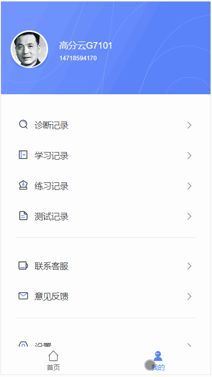

# vue 添加路由转场动画

## 前言：

> 转场动画，顾名思义，就是离开当前页面去到下个页面的切换效果，a->b 转换过程中执行的动画。

## 效果：

## 

## 思路：

> 通过 vue-router 的 meta 自定义 index，当后一个页面的 index 大于前一个页面的，执行右滑动动画，反之，则执行左滑动动画；当进入内页（底部路由为外页）的时候，执行渐变进入动画。

## 实现步骤：

### 1. 修改路由文件

> 我这里做的是只有两个主页面来回切换，也就是只有首页<----->我的

- /src/router/index.js

```js
let routes = [
  {
    path: '/home',
    name: 'home',
    component: Home,
    meta: {
      showMenu: true,
      index: 0,
      title: '首页',
    },
  },
]
```

- /src/router/modules/mine.js

```js
const mineRouter = [
  {
    path: '/mine',
    name: 'mine',
    component: () => import('@/views/mine/index'),
    meta: {
      showMenu: true,
      index: 1,
      title: '我的',
    },
  },
]

export default mineRouter
```

### 2. app.vue

```vue
<template>
  <div id="app">
    <footer-menu v-if="showMenu" />
    <transition name="fade">
      <loading v-if="this.$store.getters.getIsLoading"></loading>
    </transition>
    <!--转场动画-->
    <transition :mode="mode" :name="transitionName">
      <router-view class="center"></router-view>
    </transition>
  </div>
</template>
<script>
// @ is an alias to /src
import footerMenu from '@/components/footerMenu.vue'
import Loading from '@/components/loading'
export default {
  name: 'Home',
  components: {
    footerMenu,
    Loading,
  },
  data() {
    return {
      mode: '',
      transitionName: 'slide-left', //默认动画
    }
  },
  computed: {
    showMenu() {
      return this.$route.meta.showMenu
    },
  },
  watch: {
    $route(to, from) {
      //页面切换动画
      console.log(to)
      const toIndex = to.meta.index
      const fromIndex = from.meta.index
      if (toIndex == undefined) {
        // 当没有index的时候，去掉左右切换动画，执行渐变动画
        this.mode = 'out-in'
        this.transitionName = ''
      } else {
        // 当有index的时候，去掉渐变动画，执行左右切换动画
        this.mode = ''
        this.transitionName = toIndex < fromIndex ? 'slide-right' : 'slide-left'
      }
    },
  },

  mounted() {
    console.log('showMenu', this.showMenu, this.$store.getters.getIsLoading)
  },
}
</script>
<style lang="less">
#app {
  font-family: Avenir, Helvetica, Arial, sans-serif;
  -webkit-font-smoothing: antialiased;
  -moz-osx-font-smoothing: grayscale;
  // text-align: center;
  color: #333;
}

#nav {
  padding: 30px;

  a {
    font-weight: bold;
    color: #2c3e50;

    &.router-link-exact-active {
      color: #42b983;
    }
  }
}
</style>
```

### 3. mixin.less

```less
/*-------  全局loading样式--------*/
.fade-enter,
.fade-leave-active {
  opacity: 0;
}

.fade-enter-active,
.fade-leave-active {
  transition: opacity 0.5s;
}

/*------- 路由转场动画--内页渐变进入 --------*/
.v-enter {
  opacity: 0;
}

.v-enter-active {
  transition: 0.5s;
}

.v-enter-to {
  opacity: 1;
}

.v-leave {
  opacity: 1;
}

.v-leave-to {
  opacity: 0;
}

.v-leave-active {
  transition: 0.5s;
}

/* -----  路由转场动画--外页左右切换  ------*/
/*app.vue  的style*/
.slide-right-enter-active,
.slide-right-leave-active,
.slide-left-enter-active,
.slide-left-leave-active {
  will-change: transform;
  transition: all 500ms;
  position: absolute;
}

.slide-right-enter {
  opacity: 0;
  transform: translate3d(-100%, 0, 0);
}

.slide-right-leave-active {
  opacity: 0;
  transform: translate3d(100%, 0, 0);
}

.slide-left-enter {
  opacity: 0;
  transform: translate3d(100%, 0, 0);
}

.slide-left-leave-active {
  opacity: 0;
  transform: translate3d(-100%, 0, 0);
}
```


