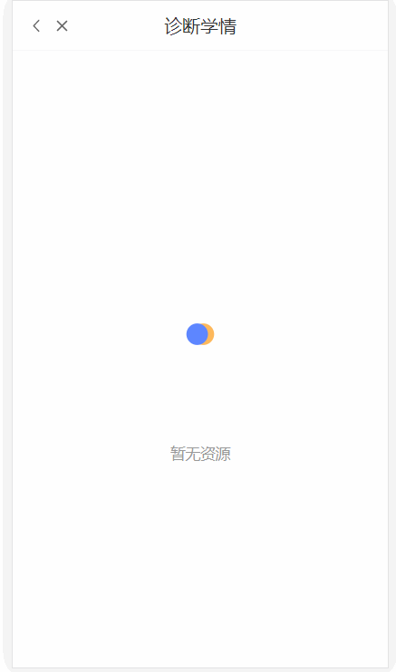

## 自定义 loading 组件

#### 思路：

> 新建 loading 组件
>
> app.vue 引入自定义 loading 组件
>
> vuex 增加全局变量控制 loading 组件的显示隐藏
>
> 请求之前 loading 显示，数据请求回来 loading 隐藏

#### 效果图：



#### 1.新建 loading 组件

> `/src/components/loading/index.vue`

```js
<!--
 * @Author: wgj
 * @Date: 2021-04-20 15:05:20
 * @LastEditTime: 2021-04-20 15:28:25
 * @LastEditors: wgj
 * @Description:
-->
<template>
<div class="loading">
    <svg-icon icon-class="icon-loading" />
</div>
</template>

<script>
export default {
  name: 'Loading' // 定义的组件名称 使用时写法：loading
}
</script>

<style scoped>
.loading {
  position: fixed;
  left: 0;
  top: 0;
  width: 100vw;
  height: 100vh;
  z-index: 1000;
  font-size: 60px;
  display: flex;
  align-items: center;
  justify-content: center;
}
</style>

```

#### 2. 公共 css 写入

> 我这里的路径是`/src/assets/mixin.less`

```less
.fade-enter,
.fade-leave-active {
  opacity: 0;
}
.fade-enter-active,
.fade-leave-active {
  transition: opacity 0.5s;
}
```

#### 3. app.vue 引入 loading 组件

```
      <transition name="fade">
        <loading v-if="this.$store.getters.getIsLoading"></loading>
      </transition>
```

#### 4.定义全局变量

> `/src/store/setting.js`

```js
/*
 * @Author: your name
 * @Date: 2020-11-13 09:25:38
 * @LastEditTime: 2021-04-20 15:56:39
 * @LastEditors: wgj
 * @Description: In User Settings Edit
 * @FilePath: \Git\plate-control-admin\src\store\modules\bind.js
 */

const state = {
  isLoading: false, //是否显示loading
}

const mutations = {
  showLoading: (state, data) => {
    state.isLoading = data
  },
}

const actions = {
  showLoading({ commit, state }, data) {
    commit('showLoading', data)
  },
}

export default {
  namespaced: false,
  state,
  mutations,
  actions,
}
```

#### 5. /utils/requests.js

```js
/*
 * @Author: wgj
 * @Date: 2021-04-20 14:04:58
 * @LastEditTime: 2021-04-21 13:54:20
 * @LastEditors: wgj
 * @Description:
 */
import Vue from 'vue'
import axios from 'axios'
import { Toast } from 'vant'
import store from '../store'
// import _ from 'lodash';
Vue.use(Toast)
const baseUrl = process.env.VUE_APP_BASE_URL
let loading_count = 0 //请求计数器

function startLoading() {
  if (loading_count == 0) {
    store.dispatch('showLoading', true)
  }
  //请求计数器
  loading_count++
}

function endLoading() {
  loading_count-- //只要进入这个函数，计数器就自减，直到。。
  if (loading_count <= 0) {
    store.dispatch('showLoading', false)
  }
}

// axios.defaults.baseURL = baseUrl;
// axios.defaults.withCredentials = false;
// axios.defaults.timeout = 6000;
const service = axios.create({
  baseURL: baseUrl, // url = base api url + request url
  withCredentials: false, // send cookies when cross-domain requests
  timeout: 6000, // request timeout
})

// Add a request interceptor
service.interceptors.request.use(
  (config) => {
    if (config.url.indexOf('?') < 0) {
      config.url = config.url + '?t=' + new Date().getTime().toString()
    } else {
      config.url = config.url + '&t=' + new Date().getTime().toString()
    }
    // store.dispatch('showLoading', true)
    startLoading()

    return config
  },
  (error) => {
    // store.dispatch('showLoading', false)
    endLoading()
    // Do something with request error
    return Promise.reject(error)
  }
)

// Add a response interceptor
service.interceptors.response.use(
  (response) => {
    // store.dispatch('showLoading', false)
    endLoading()
    store.dispatch('showIsError', false)
    return response.data
  },
  (error) => {
    if (error && error.response) {
      switch (error.response.status) {
        case 400:
          error.message = '请求错误(400)'
          break
        case 401:
          return history.push('/login')
          break
        case 403:
          error.message = '拒绝访问(403)'
          break
        case 404:
          error.message = '请求出错(404)'
          break
        case 408:
          error.message = '请求超时(408)'
          break
        case 500:
          error.message = '服务器错误(500)'
          break
        case 501:
          error.message = '服务未实现(501)'
          break
        case 502:
          error.message = '网络错误(502)'
          break
        case 503:
          error.message = '服务不可用(503)'
          break
        case 504:
          error.message = '网络超时(504)'
          break
        case 505:
          error.message = 'HTTP版本不受支持(505)'
          break

        default:
          error.message = `连接出错(${error.response.status})!`
      }
      Toast(error.message)
    } else {
      error.message = '网络异常，请稍后重试'
      store.dispatch('showIsError', true)
    }

    Toast(error.message)
    // store.dispatch('showLoading', false)
    endLoading()
    return Promise.reject(error)
  }
)

export default service
```

#### 推荐链接

> 里面可以直接下载 svg、png、jpeg、gif 等格式，超级方便！

[好看的 loading](https://loading.io/spinner/)
